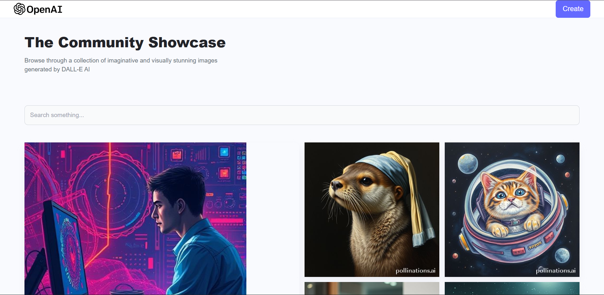
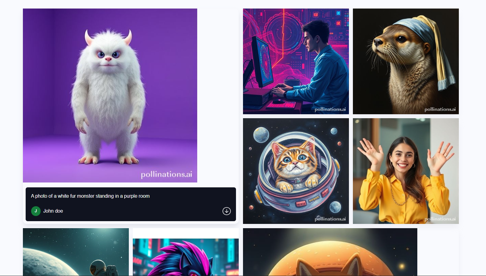
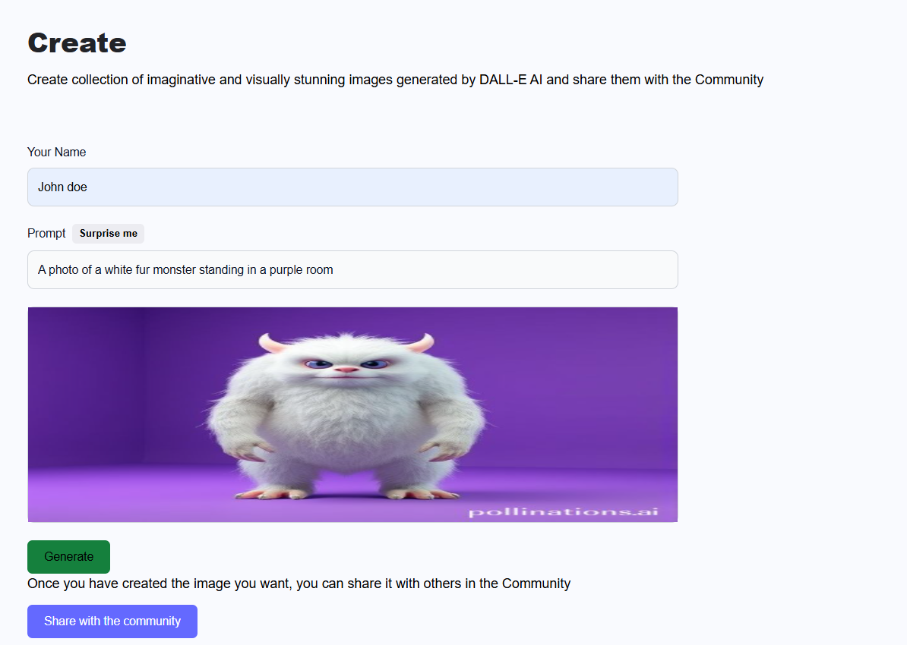

# 🎨 AI Image Generator ✨

[](https://dall-e-imagegen.netlify.app/)
[](https://opensource.org/licenses/MIT)

Welcome to the AI Image Generator! 💖 This is a magical little corner of the internet where your words turn into wonderful images, powered by OpenAI's DALL-E. Just type in a creative prompt and watch the magic happen!

---

### 🚀 Live Demo

You can try it out right now!
**[https://dall-e-imagegen.netlify.app/](https://dall-e-imagegen.netlify.app/)**

---

### 📸 Screenshots

Here’s a little sneak peek of the application in action. It’s simple, clean, and fun!

**Home Page & Prompt Input:**




**Generated Image Showcase (GIF):**
*(A GIF showing a user typing a prompt and the resulting image is highly recommended!)*


---

### 🌟 Key Features

* **🤖 AI-Powered Generation:** Utilizes the powerful DALL-E model to create stunning and unique images from text.
* **💡 Simple & Cute UI:** An easy-to-use and adorable interface that makes image generation a breeze.
* **⚡ Fast & Responsive:** Built with modern tools for a speedy and seamless experience on any device.
* **🖼️ Image Showcase:** (Optional: Add if you have a gallery) Browse a community feed of generated images.

---

### 💻 Tech Stack

This project was brought to life with these awesome technologies:

| Category      | Technologies Used                               |
|---------------|-------------------------------------------------|
| **Frontend** | `React`, `Vite`, `Tailwind CSS`                  |
| **API** | `Pollinations.AI`                                     |
| **Backend** | `Node.js`, `Express.js`                           |
| **Database** | `MongoDB`                                        |
| **Deployment**| `Netlify`                                       |

---

### 🛠️ How To Run It Locally

Want to get this running on your own computer? Follow these simple steps:

1.  **Clone the repository:**
    ```bash
    git clone [https://github.com/your-username/your-repo-name.git](https://github.com/your-username/your-repo-name.git)
    ```
2.  **Navigate to the project directory:**
    ```bash
    cd your-repo-name
    ```
3.  **Install the dependencies:**
    ```bash
    npm install
    ```
4.  **Set up your environment variables:**
    Create a `.env` file and add your OpenAI API key:
    ```
    OPENAI_API_KEY="your-secret-api-key-here"
    ```
5.  **Start the development server:**
    ```bash
    npm run dev
    ```
6.  Open your browser and visit `http://localhost:5173` (Vite's default port) to see the magic! ✨

---

### 💌 Let's Connect!

If you liked this project or want to chat, feel free to reach out!

* **GitHub:** ((https://github.com/AmandeepKaur-ADK))
* **LinkedIn:** ((https://www.linkedin.com/in/amandeep-kaur-876951242/))

---
<p align="center">
  Made with lots of ❤️ and a little bit of code.
</p>
